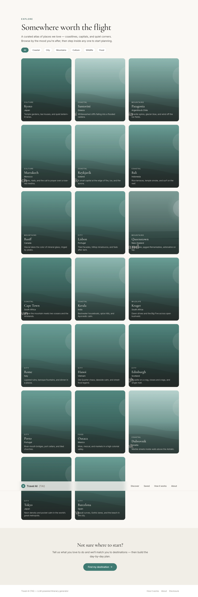
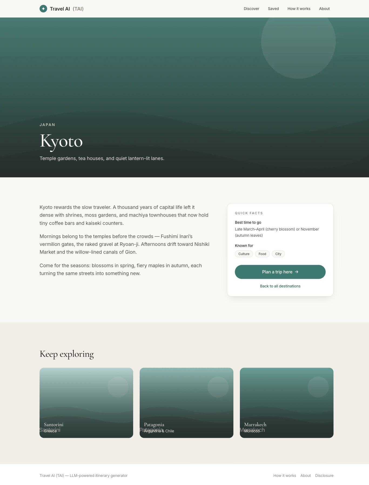
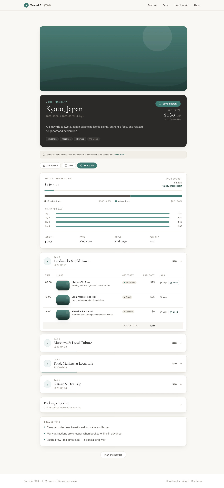
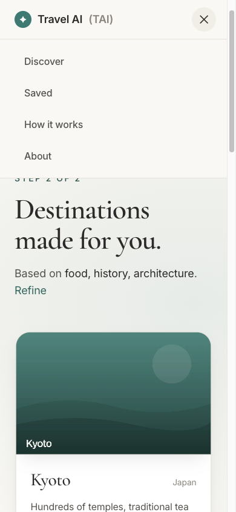
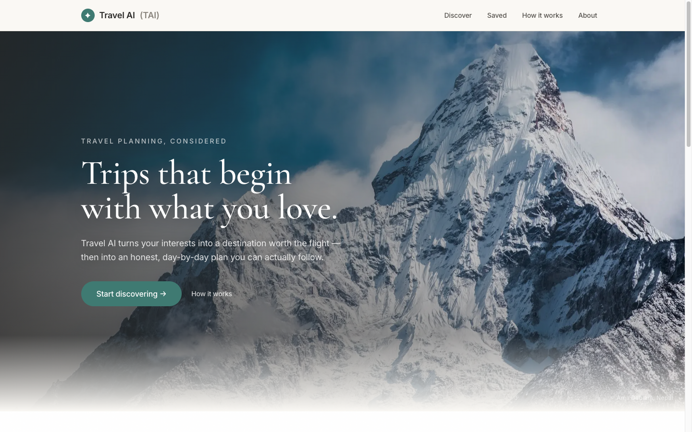

# Travel AI (TAI) — LLM Itinerary Generator

Enter your travel preferences; get back a structured, day-by-day itinerary generated
by an LLM and served through a scalable Python API. TAI is a full-stack reference
implementation: a **FastAPI** async backend with a preference→prompt recommendation
engine, OpenAI structured-output generation validated by **Pydantic**, response caching,
rate limiting, and persistence — paired with a **React + Vite + TypeScript + Tailwind**
multi-step frontend.

[](https://github.com/billdmar/travel-ai-tai/actions/workflows/ci.yml)


[](https://travel-ai-tai.onrender.com)

**🔗 Live demo:** [https://travel-ai-tai.onrender.com](https://travel-ai-tai.onrender.com) — runs in mock-LLM mode (no API key), so itineraries are generated from a deterministic stub. _Free tier sleeps when idle; first request may take ~30s to wake._

**📦 Latest release:** [v1.0.0](https://github.com/billdmar/travel-ai-tai/releases/tag/v1.0.0) — see the [CHANGELOG](CHANGELOG.md) for the full history.

<p align="center">
  
</p>

---

## Features

- **Structured itineraries** — destination, dates, budget, interests, pace, dietary &
  accessibility needs → a validated day-by-day plan with per-activity time, place, cost,
  category, and map link.
- **Recommendation engine** — maps structured preferences into an engineered LLM prompt,
  enforces JSON output, and validates every response against a Pydantic schema. The LLM
  never invents server-owned fields (id, timestamps) — those are attached server-side.
- **Pluggable LLM providers** — OpenAI (default), a deterministic **mock** (used by all
  tests and local dev, zero cost / no key), Gemini, and an optional LangChain wrapper.
- **Destination discovery** — turn a few hobbies (plus optional free text) into 4–6
  tailored destination ideas via `POST /api/v1/destinations/recommend`, each with a fit
  rationale, tags, best season, and an image query.
- **Affiliate booking links** — every bookable activity gets a server-owned `booking_url`
  (Viator/GetYourGuide for attractions & leisure, Booking.com for stays, a flights search
  for transport). Affiliate tags are config-driven and empty by default, so links are
  clean plain deep links with **no tracking params** until you set a tag.
- **Server-side image proxy** — `GET /api/v1/images?query=` proxies Unsplash so the access
  key never reaches the browser; with no key (or any upstream failure) it returns a
  graceful `{fallback:true}` envelope and the UI shows a bundled placeholder.
- **Production-style API** — async handlers, response caching, per-IP rate limiting,
  retry/backoff, soft-delete, pagination, and auto-generated OpenAPI docs at `/docs`.
- **Polished frontend** — a destination-discovery flow, multi-step preference wizard,
  collapsible day cards with Map + Book links, an FTC affiliate-disclosure banner, a
  saved-trips page, and friendly error states for validation / rate-limit / LLM-unavailable
  cases.

## What's new

Recent additions on top of the core generate-and-save flow (all backed by the routes
listed under [API reference](#api-reference)):

- **Interactive map** — a Leaflet `MapView` plots an itinerary's activities so a trip can
  be read spatially, not just as a list.
- **Trip regeneration** — `POST /api/v1/itineraries/{id}/regenerate` re-runs generation
  from *adjusted* preferences anchored to a source trip, minting a new itinerary while
  leaving the original row intact.
- **Client-side itinerary editing** — `PUT /api/v1/itineraries/{id}/days/{n}/activities`
  (replace a day) and `DELETE …/activities/{i}` (drop one activity) let the UI tweak a
  saved plan.
- **Export — ICS + PDF + Markdown** — `GET /api/v1/itineraries/{id}/export?format=` streams
  a download: a premium PDF (`fpdf2`, with a `503` when the optional lib is absent), an RFC
  5545 `.ics` calendar (pure stdlib, always available), or Markdown.
- **Dynamic Open Graph image** — `GET /api/v1/itineraries/{id}/og-image` renders a
  1200×630 PNG social card per trip (cached ~1h) so shared links preview nicely.
- **Trip comparison** — a `/compare` page puts two itineraries side by side.
- **Curated destinations** — `GET /api/v1/destinations/curated` serves a DB-backed Explore
  atlas, with a bundled static fallback if it's unavailable.
- **PWA / offline** — `vite-plugin-pwa` + a static `web/public/manifest.json` register a
  service worker so the shell is installable and works offline.
- **Opt-in observability** — Prometheus request metrics (`GET /metrics`, gated by
  `ENABLE_METRICS`), Sentry error tracking (`SENTRY_DSN`), and request-scoped JSON log
  context. All three are **no-ops by default** so the live deploy is unchanged unless
  explicitly enabled.

> **Honest LLM note.** The hosted demo still runs in **mock-LLM mode** — the OpenAI and
> Gemini providers are implemented and unit-tested, but the live deploy's Gemini quota is
> exhausted, so it serves the deterministic mock fallback rather than real model output.

## Screenshots

A quiet-luxury interface: warm ivory + charcoal with a sparing blue-green accent, Cormorant
serif headlines over an Inter body, and slow eased motion with strict reduced-motion fallbacks.

| Discover destinations | Tailored results |
|---|---|
| [](docs/screenshots/best/explore-desktop.png) | [](docs/screenshots/best/results-desktop.png) |

| Destination landing | Day-by-day itinerary |
|---|---|
| [](docs/screenshots/best/destination-kyoto-desktop.png) | [](docs/screenshots/best/itinerary-desktop.png) |

**Shared, read-only itinerary** — a public link with no save/delete controls:

[](docs/screenshots/best/share-desktop.png)

**Responsive & accessible** — mobile layouts, a slide-in nav, and a `prefers-reduced-motion` fallback that drops the Ken Burns hero motion:

| Mobile hero | Mobile nav | Reduced motion |
|---|---|---|
|  |  |  |

## Architecture

```
React (Vite/TS/Tailwind)                FastAPI (async)
┌───────────────────────┐  POST /api/v1  ┌──────────────────────────────────────┐
│ PreferenceForm (4-step)│ ─────────────▶ │ routes/itineraries.py                  │
│ ItineraryView/DayCard  │ ◀───────────── │   └─ RecommendationEngine.generate()   │
└───────────────────────┘   ItineraryJSON │        ├─ cache key = SHA-256(prefs)   │
                                          │        ├─ ItineraryCache (TTL/Redis)   │
                                          │        ├─ LLMProvider.complete()  ◀──┐ │
                                          │        │     openai | mock | langchain│ │
                                          │        ├─ GeneratedItinerary.validate │ │
                                          │        └─ persist → SQLAlchemy (async) │ │
                                          └──────────────────────────────────────┘ │
                                            prompts/itinerary.py (schema-locked) ───┘
```

The LLM returns only creative content (`GeneratedItinerary`); the engine attaches the
server-owned `id`, `created_at`, and echoed `preferences` to build the full
`ItineraryResponse`. This is why repeating an identical request returns the **same**
stored itinerary (cache hit) rather than a fresh LLM call.

## Quickstart (local)

```bash
# Backend (uses the mock provider by default — no API key needed)
uv venv --python 3.11 && uv pip install -r requirements-dev.txt
cp .env.example .env                       # LLM_PROVIDER=mock works out of the box
.venv/bin/uvicorn api.main:app --reload    # http://localhost:8000  (/docs for Swagger)

# Frontend (separate terminal)
cd web && npm install && npm run dev        # http://localhost:5173 (proxies /api → :8000)
```

To use real OpenAI generation, set `OPENAI_API_KEY` and `LLM_PROVIDER=openai` in `.env`.

## Quickstart (Docker)

```bash
docker-compose up --build      # serves API + built React UI from http://localhost:8000
```

The multi-stage `Dockerfile` builds the React frontend, then serves it and the API
from a single Python container. It binds `$PORT` when the platform provides one
(Render/Cloud Run/Heroku) and falls back to `8000` locally.

## Deploy (Render — free)

A [`render.yaml`](render.yaml) blueprint is included for one-click deployment:

1. On [Render](https://render.com), choose **New + → Blueprint** and select this repo.
2. Approve the plan. Render builds the Dockerfile and serves the app at `$PORT`.
3. The blueprint sets `LLM_PROVIDER=mock` and `CACHE_BACKEND=memory`, so the demo
   runs with no API key and no external database.

To enable real OpenAI generation, add an `OPENAI_API_KEY` env var and set
`LLM_PROVIDER=openai` in the Render dashboard.

## API reference

| Method | Path | Description |
|--------|------|-------------|
| POST | `/api/v1/itineraries` | Generate an itinerary from preferences (201) |
| POST | `/api/v1/itineraries/{id}/regenerate` | Regenerate from adjusted preferences, anchored to a source trip (new id; source left intact) |
| POST | `/api/v1/itineraries/stream` | Same generation as a Server-Sent Events stream (`text/event-stream`) |
| GET | `/api/v1/itineraries/{id}` | Retrieve a saved itinerary |
| GET | `/api/v1/itineraries?page=&per_page=` | Paginated list (excludes soft-deleted) |
| POST | `/api/v1/itineraries/{id}/save` | Persist a generated itinerary |
| PUT | `/api/v1/itineraries/{id}/days/{n}/activities` | Replace a day's activities (client-side editing) |
| DELETE | `/api/v1/itineraries/{id}/days/{n}/activities/{i}` | Remove a single activity |
| DELETE | `/api/v1/itineraries/{id}` | Soft-delete |
| GET | `/api/v1/itineraries/{id}/export?format=markdown\|pdf\|ics` | Download as Markdown, premium PDF, or an RFC 5545 ICS calendar |
| GET | `/api/v1/itineraries/{id}/og-image` | 1200×630 PNG Open Graph card (cached ~1h) |
| POST | `/api/v1/itineraries/{id}/share` | Mint a public read-only share token |
| GET | `/api/v1/shared/{token}` | Fetch a shared, read-only itinerary |
| POST | `/api/v1/destinations/recommend` | Destination discovery from interests |
| GET | `/api/v1/destinations/curated` | DB-backed curated Explore atlas |
| GET | `/api/v1/images?query=` | Server-side Unsplash proxy (graceful fallback) |
| POST | `/api/v1/preferences/validate` | Validate preferences without calling the LLM |
| GET | `/health` | Liveness + version |
| GET | `/ready` | Readiness probe (DB + cache reachable) |
| GET | `/metrics` | Prometheus metrics (opt-in; only when `ENABLE_METRICS=true`) |
| GET | `/docs` | Swagger UI |

## Environment variables

| Variable | Default | Purpose |
|----------|---------|---------|
| `LLM_PROVIDER` | `mock` | `openai` \| `mock` \| `gemini` \| `langchain` (falls back to mock if no key) |
| `OPENAI_API_KEY` | — | Required for the OpenAI/LangChain providers |
| `OPENAI_MODEL` | `gpt-4o-mini` | OpenAI chat model |
| `GEMINI_API_KEY` | — | Required for the `gemini` provider |
| `GEMINI_MODEL` | `gemini-2.0-flash` | Gemini model |
| `GEMINI_FALLBACK_TO_MOCK` | `true` | On Gemini failure (e.g. free-tier 429) serve a mock result instead of a `503`, so the live demo always returns something |
| `MAX_TOKENS` | `2000` | Per-completion token cap (cost control) |
| `LLM_TIMEOUT_SECONDS` | `30.0` | Upper bound for a single LLM generation call before it's treated as a failure |
| `HTTP_TIMEOUT_SECONDS` | `10.0` | Timeout for outbound HTTP calls (e.g. the Unsplash image proxy) |
| `UNSPLASH_ACCESS_KEY` | — | Enables live Unsplash images via the proxy; without it the proxy returns a `{fallback:true}` envelope |
| `DATABASE_URL` | `sqlite+aiosqlite:///./tai.db` | Async DB URL (Postgres-ready) |
| `CACHE_BACKEND` | `memory` | `memory` \| `redis` (Redis falls back to in-memory) |
| `REDIS_URL` | — | Used when `CACHE_BACKEND=redis` |
| `RATE_LIMIT_ENABLED` | `true` | Toggle per-IP rate limiting |
| `ALLOWED_ORIGINS` | `http://localhost:5173` | Comma-separated CORS origins |
| `DEBUG_MODE` | `false` | Exposes `/api/v1/debug/token-stats` |
| `LOG_LEVEL` | `INFO` | Logging verbosity |
| `HEALTH_CHECK_TIMEOUT_SECONDS` | `2.0` | Per-dependency probe timeout for `/ready` (DB/cache) so a hung backend reports not-ready instead of hanging |
| `ENABLE_METRICS` | `false` | **Opt-in.** Wires the metrics middleware + `GET /metrics` (Prometheus exposition). No-op by default |
| `SENTRY_DSN` | — | **Opt-in.** Enables Sentry unhandled-exception reporting; with no DSN the SDK never loads (no-op) |
| `SENTRY_TRACES_SAMPLE_RATE` | `0.0` | Sentry performance trace sample rate (only relevant when `SENTRY_DSN` is set) |
| `SENTRY_ENVIRONMENT` | `production` | Sentry environment tag (only relevant when `SENTRY_DSN` is set) |

## Scalability design

The backend is built to serve many concurrent users; these are the concrete mechanisms
(and the interview-relevant reasoning behind them):

1. **Async end-to-end.** Every route handler is `async def` and database access uses
   SQLAlchemy 2.0's async engine + `async_sessionmaker`, so the event loop is never
   blocked on I/O — one process handles many in-flight LLM/DB calls concurrently.
2. **Response caching.** Identical preference payloads hash to the same SHA-256 key and
   return the stored itinerary (TTL 1h) instead of re-calling the LLM — the dominant cost
   and latency source. Cache backend is in-memory by default, Redis-swappable for
   multi-process horizontal scaling.
3. **Rate limiting.** `slowapi` caps `POST /itineraries` at 10 req/min/IP, protecting the
   upstream LLM budget and the service from abuse; returns `429` with `Retry-After`.
4. **Retry & graceful degradation.** `tenacity` retries transient OpenAI rate-limit/timeout
   errors with exponential backoff; on exhaustion the API returns `503` with `Retry-After`
   rather than hanging.
5. **Connection pooling & stateless design.** SQLAlchemy pooling plus stateless handlers
   mean the API scales horizontally behind a load balancer; SQLite is the default,
   Postgres is a one-line `DATABASE_URL` swap.

> **Honest scope note.** The resume frames this project as "serving 200+ users." That is a
> *design target* demonstrated by the mechanisms above and a concurrency smoke test
> (`tests/test_concurrency_smoke.py` fires many simultaneous requests against the mock
> provider and asserts they all succeed) — **not** a measured production load test.
> The OpenAI path is implemented and unit-tested via mocked errors, but in this
> environment all runtime verification uses the mock provider (no API key).

## Testing

An **80-test** suite runs entirely against the mock LLM provider — no API key and no
network — so it's fast and deterministic in CI. Coverage spans the cache-hit identity
guarantee, rate-limit isolation (429), error mapping (503/502), request validation,
destination discovery, affiliate-link generation (plain vs. tagged), the Unsplash image
proxy (fallback + payload parsing), and a concurrency smoke test that fires many
simultaneous requests and asserts they all succeed.

## Development

```bash
.venv/bin/pytest -q                 # full test suite (mock provider, no network)
.venv/bin/ruff check api/ tests/    # lint
cd web && npm run build             # type-check + production build
```

## License

[MIT](LICENSE) © William Mar
